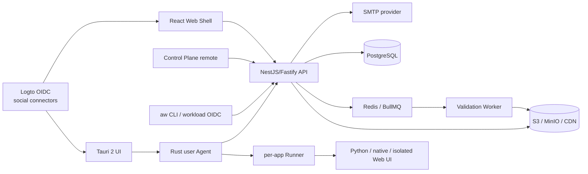
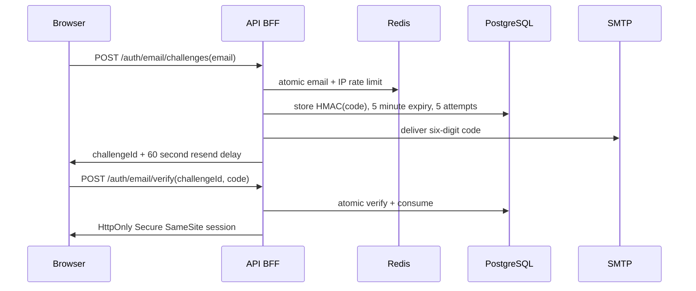
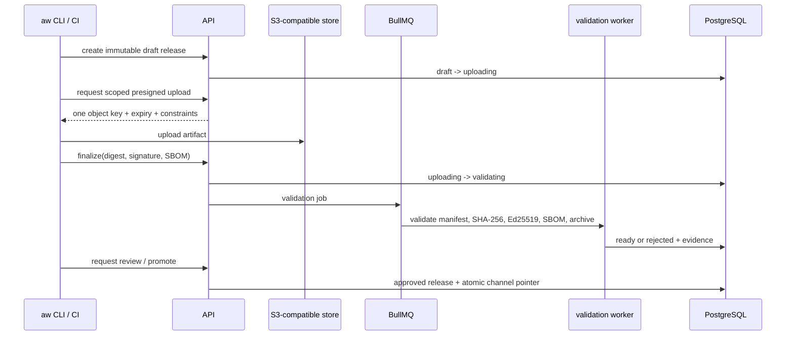

# Architecture and data flow

## First-principles boundary

The product has one control plane and two runtime adapters. Identity, tenancy,
catalog, immutable release, artifacts, channel promotion, review, permissions,
and audit are shared. Web and desktop differ only where code loading and local
execution genuinely differ.

## Identity flow

### Browser

Email OTP is owned by the BFF so its security policy is not coupled to an IdP's
fixed passcode constants. Production uses SMTP with implicit TLS or mandatory
STARTTLS; `noop` delivery and development secrets fail configuration parsing.
The code is never returned outside tests or written to logs.

Google, Feishu, and WeChat use a separate Logto Authorization Code + PKCE flow.
The API sends `direct_sign_in=social:<provider>` only for an explicitly enabled
provider, validates state and nonce, exchanges the code server-side, and
requires a verified email claim before issuing the same BFF session. The
browser never stores an OIDC refresh token. Equal email addresses do not merge
identities automatically. Provider descriptors come from
`/api/v1/auth/providers`; provider credentials remain in Logto.

### Desktop

The UI asks the Agent to start login. The Agent opens the system browser and
uses Authorization Code with PKCE. The loopback callback is bound to loopback,
validates state, and closes after one use. Refresh material is stored only in
Windows Credential Manager or macOS Keychain. The WebView receives a user and
workspace summary, never tokens.

People, CI publishers, devices, and task leases are four different principal
types. They cannot substitute for one another.

## Release data flow

Validation rejects duplicate versions, digest mismatch, invalid signatures,
missing SBOM, unsupported host/platform, absolute archive paths, `..` path
traversal, symlinks escaping the extraction root, excessive file count or
expanded size, and permission expansion without a new review.

The Control Plane reads immutable history from
`GET /api/v1/workspaces/:workspaceId/releases`; it never infers drafts or
review requests from channel pointers. `GET /api/v1/reviews` returns only
validated `ready` releases for the selected workspace. Application creation,
release creation, review decisions, and channel promotion write user-attributed
audit events in the same PostgreSQL transaction as the state change.

## Web runtime flow

The Shell resolves a channel to a signed catalog entry. A `federation` release
is allowed only for trusted and approved code; it exposes `mount(container,
context)` and `unmount()`. Federation is an isolation mechanism for independent
delivery, not a security sandbox.

An `iframe` release loads from an application-specific origin. The iframe has
no same-origin permission, popup, download, or top-navigation capability by
default. Handshake messages require both the configured `origin` and the exact
`contentWindow` source before a `MessageChannel` is transferred. Every method
is checked against the manifest capability set.

The third `link` runtime is navigation only and requires an HTTPS destination
bound into the approved, signed manifest. It receives no host bridge.

### Locale flow

`system | en-US | zh-CN` is resolved at each host boundary into a concrete
locale snapshot. The Web Shell owns its preference and sends only the resolved
locale, fallbacks, direction, and time zone through `locale.getCurrent()` and
`locale.changed`; each Federation or iframe application owns an independent
message catalog. API requests negotiate human-readable errors and login email
with `Accept-Language`, while application metadata travels as canonical content
plus optional locale overlays.

## Desktop runtime flow

The Tauri WebView manages UI and consent but does not schedule or execute work.
The user-level Agent persists installations, schedule revisions, runs, and a
log outbox in SQLite. It continues after the UI exits and uses the last
server-confirmed schedule while offline.

Install is `download -> digest/signature verify -> safe extract to staging ->
manifest/platform check -> permission review -> atomic activate`. The previous
version remains addressable for rollback. A dedicated Runner gets only an
allowlisted environment and a short task lease. It never receives the platform
credential. Privileged lifecycle actions use a one-shot helper with an exact
allowlist; an unattended job becomes `needs_user_approval` rather than opening
an elevation prompt or silently escalating.

The Tauri UI resolves and persists its own display preference, then synchronizes
the resolved locale to the authenticated Agent management endpoint. The Agent
persists the latest setting and copies it into a task-specific SQLite row at
task creation. Runner environment and Web UI task context read that frozen row,
not the current UI or Manifest default, so offline and already-running tasks are
deterministic.

## Persistence ownership

| Data                                       | Authority                          | Cache / replica       |
| ------------------------------------------ | ---------------------------------- | --------------------- |
| users, identities, workspaces, roles       | PostgreSQL                         | BFF session summary   |
| applications, releases, channels, reviews  | PostgreSQL                         | Redis catalog cache   |
| artifacts, SBOM, provenance                | S3-compatible store                | CDN by content digest |
| validation jobs                            | PostgreSQL state + BullMQ delivery | worker process        |
| desktop installation/run/schedule snapshot | API/PostgreSQL                     | Agent SQLite          |
| desktop display locale and task snapshots  | user / task creation boundary      | Agent SQLite          |
| desktop secrets                            | OIDC provider                      | OS Keychain only      |
| audit events                               | PostgreSQL append-only interface   | OTLP export           |
